# terra-git User Handbook

A fast, lightweight Git desktop client with first-class support for self-hosted
GitLab alongside GitHub. This handbook covers everyday use, the power features,
and where to look when something goes wrong. It only documents what actually
exists in the app today — see [FEATURES.md](FEATURES.md) for the full
feature-parity matrix against GitHub Desktop.

## Contents

- [Introduction](#introduction)
- [Getting started](#getting-started)
- [Managing repositories](#managing-repositories)
- [The main window](#the-main-window)
- [Everyday flow](#everyday-flow)
- [Reading diffs](#reading-diffs)
- [History](#history)
- [Branches & merging](#branches--merging)
- [Resolving conflicts](#resolving-conflicts)
- [Rewriting history safely](#rewriting-history-safely)
- [Stashing and parking work](#stashing-and-parking-work)
- [Remotes, pull and merge requests](#remotes-pull-and-merge-requests)
- [Testing pipelines locally](#testing-pipelines-locally)
- [Repository maintenance](#repository-maintenance)
- [Settings](#settings)
- [Keyboard shortcuts](#keyboard-shortcuts)
- [When something fails](#when-something-fails)
- [Troubleshooting](#troubleshooting)

## Introduction

terra-git is built with Tauri 2 (a Rust core, no Chromium bundled) and a
Svelte 5 frontend. It aims for GitHub Desktop's day-to-day workflow while
adding the things self-hosted GitLab users tend to miss: real remote
management, a merge/pull-request list with inline CI status for GitHub,
GitLab and Gitea/Forgejo, and a pipeline cockpit that can run CI jobs
locally before you push. Authentication for fetch/pull/push/clone goes
through your system's own Git — whatever credential helper or SSH agent
you already use keeps working, with no separate sign-in required.

## Getting started

From the start screen you can:

- **Open a repository** — pick an existing folder on disk. `Ctrl+O` does the
  same thing without reaching for the button.
- **Clone a repository** — paste an HTTPS or SSH URL and pick a parent
  folder; the folder name is derived from the URL unless you type your own.
  **Scope** decides how much is fetched: the full history, blobless (file
  contents fetched on demand — ideal for large repositories), or shallow
  (only the most recent commits, to a depth you set). A branch can be named
  instead of the remote's default. Cloning opens the window immediately and
  streams fetch progress in the background, so you are not staring at a
  blank screen while a large repo downloads.
- **Initialize a new repository** — turn an empty or existing folder into a
  fresh Git repo.
- **Open a recent repository** — the start screen keeps a list of
  previously opened repositories for one-click access. Each entry shows its
  current branch and an amber dot when there are uncommitted changes.
- **Drop a folder onto the window** — dragging a folder from your file
  manager onto terra-git opens it. The start screen advertises this in its
  footer (*Drop a folder here to open it*), and it works with a repository
  already open too — the dropped folder then replaces it. A folder that is
  not a Git repository reports *Not a Git repository.* rather than silently
  doing nothing.

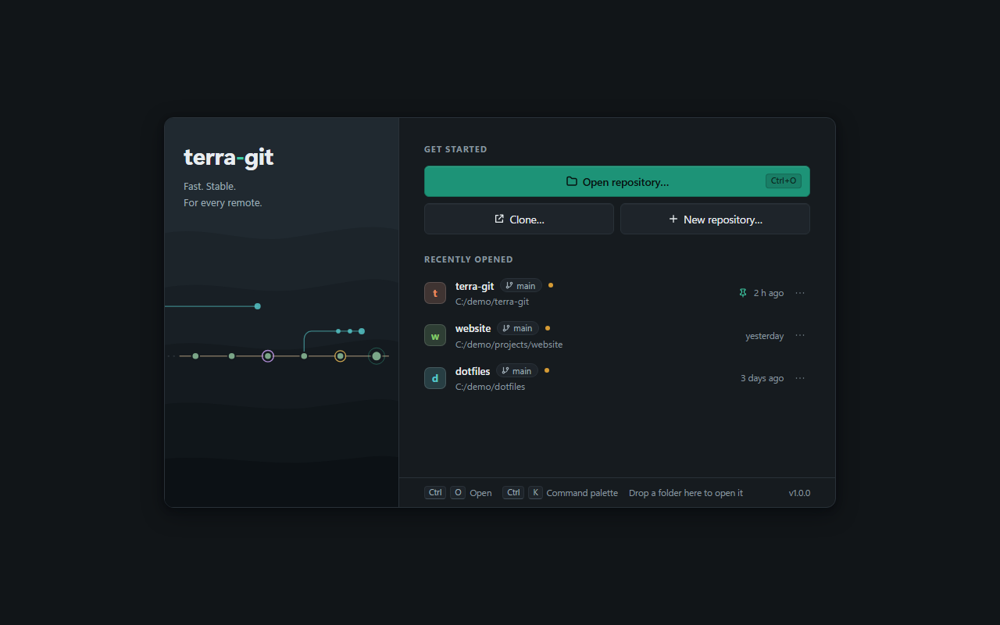

The brand panel on the left is not just decoration: it sketches the
repository under the mouse (or the last opened one) — the main line is the
current branch's recent commits, side strands are local branches drawn from
the point where they forked, and tagged commits carry an ochre ring. The
sketch draws itself left to right when the repository changes.

The strip under the two columns carries the `Ctrl+O` and `Ctrl+K` hints, the
drop hint, and the installed version number — so you can read your version
without opening anything.

New repositories are initialized with `main` as the default branch (a
`init.defaultBranch` you configured yourself always wins). Creating or
renaming a branch also works before the first commit — the branch becomes
real together with the first commit. Until then the branch menu says so
rather than showing an empty list: *No commits yet — “main” is created with
the first commit. A branch created below becomes the initial branch.*

A brand-new repository has no remote either, so fetch, pull and push stay
out of reach until you add one — the toolbar's `…` menu → **Manage** →
**Manage remotes…** is where that happens, and the dialog says as much when
the list is empty.

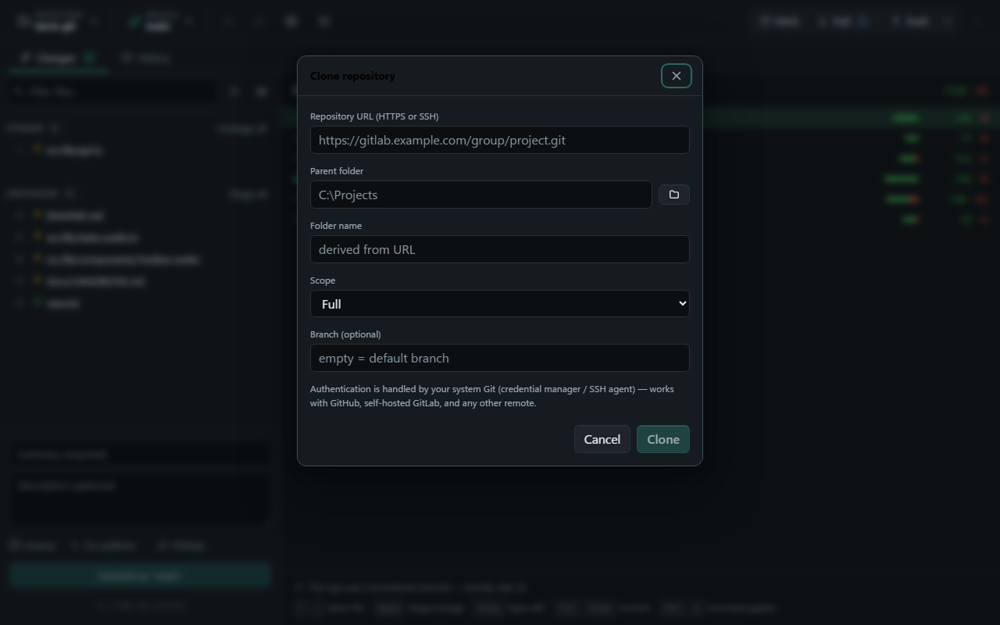

**The clone dialog in detail.** **Folder name** follows the URL until you
type in it; from that moment the name is yours and is never overwritten
again. The line *Will be cloned to:* shows the exact path that will be
created, and **Clone** stays disabled until both a parent folder and a name
exist. The dialog also states where credentials come from —
*Authentication is handled by your system Git (credential manager / SSH
agent) — works with GitHub, self-hosted GitLab, and any other remote.*

Because the repository is created and opened before the data arrives, two
things follow. The download can be stopped from the banner that runs across
the top while it works (*Cloning “name”…* with a phase, a percentage and a
cancel button). And if it fails or you cancel it, the repository stays open
as an empty local repository with its remote already configured — you can
simply fetch again instead of starting over.

Cloning over SSH from a host you have never contacted stops at a fingerprint
question first; see [Unknown SSH hosts](#unknown-ssh-hosts).

## Managing repositories

From the start screen, every entry in the recent-repositories list carries
a permanently visible `⋯` action menu with three entries: **Pin** (pinned
repositories carry a *Pinned* marker, sort to the top and are spared when
the list is capped at 15 entries), **Remove from list** (just forgets it —
the files on disk are untouched) and **Move to trash…** (moves the entire
repository folder to the operating system's recycle bin/trash, not a
permanent delete). Moving to the trash is confirmed twice: once in the app,
which shows the full path, and then again in a dialog put up by the
operating system itself — that second one is deliberately outside the app's
reach. Before you have opened anything the list reads *Repositories you open
will appear here.*

You do not have to come back here to change repositories. The leftmost
toolbar segment — the one labelled **Repository** above the repository name
— is a menu: **Open another repository…**, **Clone repository…**, **New
repository…**, **Close repository (back to start)**, and below a separator a
**Recently opened** list of your other recent repositories by folder name.
One click switches. Hovering the segment shows the full path, and so does
each recent entry, which is how you tell two folders with the same name
apart.

Switching replaces the repository in the current window. If you want two at
once, open a second window first: `…` menu → **Open** → **New window**
starts a fully independent terra-git window with its own repository.
Settings, accounts and the recents list are shared, because they belong to
the installation rather than to a window.

## The main window

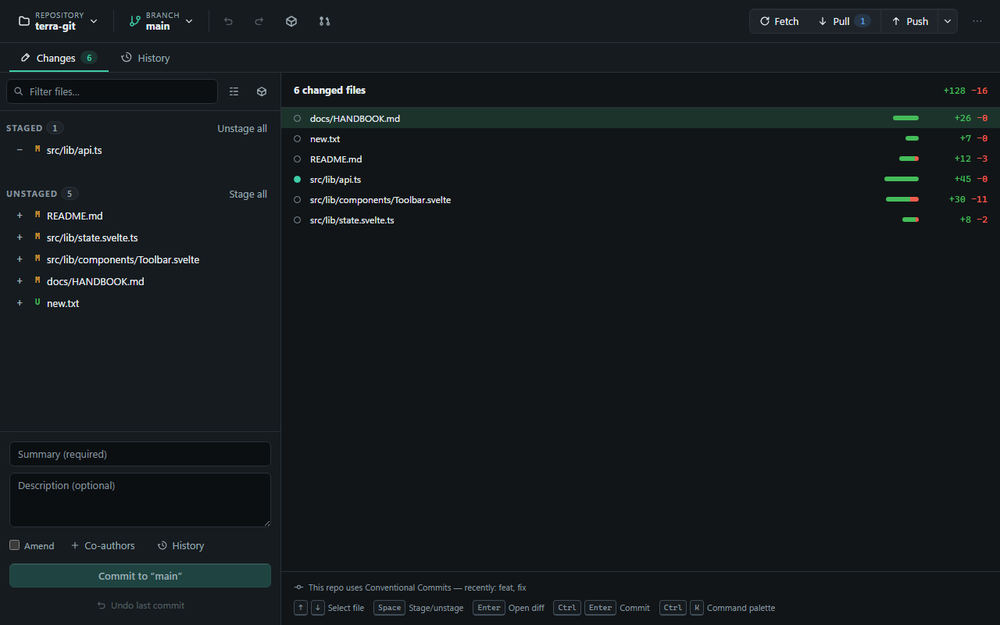

The toolbar across the top, left to right:

- the **Repository** segment (the menu described above) and the **Branch**
  button next to it;
- **undo** and **redo** arrows for local operations — see
  [Undo and redo](#undo-and-redo);
- a **stash** icon (*Manage stashes*) and a **Show Pull Requests** /
  **Show Merge Requests** button, labelled after the provider your remote
  points at;
- **Fetch**, **Pull** and **Push** with ahead/behind counts, the push button
  carrying a dropdown for push-to-a-specific-remote, **Force push
  (--force-with-lease)** and **Manage remotes…**;
- a **Commit workshop** button (tooltip *Edit unpushed commits*), which
  appears whenever the branch is ahead of its remote *or* has no upstream at
  all;
- the `…` menu (**More actions**) at the right-hand end.

**The `…` menu** is the hub the rest of this handbook keeps pointing at. It
has four named sections:

- **Tools** — **Commit workshop**, **Test pipeline locally…**, and
  **Conflict workshop**. The last one is always listed, greyed out with the
  reason beside it while no merge, rebase, cherry-pick or revert is running,
  and showing the number of open conflicts while one is.
- **Manage** — **Manage tags…**, **Submodules…**, **Worktrees…**, **Sparse
  checkout…**, **Manage remotes…**, **Backups…**.
- **Open** — **Reveal in file manager**, **Open in editor**, **Open terminal
  here**, **New window**, **Open log folder**.

The fourth, **Theme**, holds **Dark**, **Light** and **System** with a
checkmark on the active theme, and **Settings**. Switching theme therefore never requires
opening Settings.

All three **Open** entries act on the repository folder. **Open in editor**
runs the editor command from Settings → App and defaults to `code`; on
Windows terra-git also tries the `.cmd` shim that editors like VS Code
install, so `code` works out of the box. The setting takes a plain program
name only — an editor that needs command-line flags will not start this way.
**Open terminal here** opens Windows Terminal if it is installed and a
classic console otherwise, Terminal on macOS, and your desktop's terminal on
Linux, always with the repository as the working directory. **Open log
folder** is described under [When something fails](#when-something-fails).

**The command palette.** `Ctrl+K` opens a searchable list of state-aware
commands, grouped by area (sync, tools, views, manage, open, branches,
application); typing filters by every word you type — each has to appear
somewhere in a command's label or hint (so `rem` already finds *Manage remotes…*),
and a hit at the start of the label sorts first. Arrow keys move the
selection, `Enter` runs it, `Escape` closes it, and the mouse pointer
selects whatever it moves over; with no match it says *No command found.*
Some entries carry the shortcut on the right — *git fetch · Ctrl+Shift+F*,
*git pull · Ctrl+Shift+U*, *git push · Ctrl+Shift+P*, *Ctrl+Z*, *Ctrl+Y* —
which makes the palette the closest thing the app has to a cheat sheet.
Every local branch you are not currently on appears as its own "switch to"
command.

The palette also works on the start screen, with the commands that need no
repository: **Open repository…**, **Clone repository…**, **New
repository…**, the three theme commands and **Language: English** /
**Language: Deutsch**. That is the fastest way to change theme or language
before you have opened anything. **Settings** is listed there too, but it has
no effect until a repository is open — the start screen always wins (see
[Settings](#settings)).

Two limits are deliberate rather than broken. `Ctrl+K` does nothing while a
dialog is open — the palette would otherwise navigate the view out from
under it and lose unsaved work in the conflict editor. And sync and
branch-switch commands drop out of the list while an operation is running,
which is why the list changes length. Nearly everything in the `…` menu is
in the palette too; sparse checkout, **New window** and **Open log folder**
are menu-only.

Below the toolbar are two tabs (`←`/`→`, `Home` and `End` move between them
when the strip has focus):

- **Changes** — the staged/unstaged file lists on the left, the commit box
  at the bottom, and on the right either the diff of the selected file or —
  while nothing is selected — a **changes overview**: one row per changed
  file with its staging state, `+`/`−` line counts and a delta bar.
- **History** — the full repository graph with search, branch/tag badges,
  per-commit diffs, and a repository overview while no commit is selected.

The divider between the list and the diff can be dragged in both tabs
(tooltip *Resize panel*), within limits, and each width is remembered
between sessions.

The commit workshop, the conflict workshop and the pipeline cockpit are not
dialogs: each replaces the two tabs with a full-window view, keeping the
toolbar. A **Back** button in the view's own header returns you to the
workspace.

## Everyday flow

**The list toolbar.** Above the staged and unstaged lists sit three
controls: a **Filter files…** field, an icon that toggles between **Tree
view** and **List view** (the choice is remembered), and a stash icon
(**Stash all changes…**), disabled when there is nothing to stash. The
filter matters more than it looks: it matches anywhere in the path, and
while it holds text the section buttons change from **Stage all** /
**Unstage all** to **Stage matches** / **Unstage matches** — which is how
you stage a subset of a large change without clicking every row.

**Staging and unstaging.** Click a file to preview its diff. Click the
`+`/`−` icon on a row to stage or unstage it. You can select several files
at once (Ctrl/Shift-click, Ctrl+A) on either the unstaged or the staged
side; the right-click menu on a multi-selection offers **Stage selection**
on the unstaged side and **Unstage selection** on the staged one, plus
**Discard changes** on the unstaged side. Individual hunks and individual
lines can be staged and unstaged directly from the diff view (see
[Reading diffs](#reading-diffs)); discarding works per file and per hunk.

Discarding is the one everyday action that is not undoable. It asks first —
*Permanently discard changes to “path”?*, and the confirmation adds
*Untracked files will be deleted.* — and once you confirm, that content is
gone: it never lands on the undo stack, and no backup is written for it.

**The file row `⋯` menu** (*File actions*) holds four entries: **Show
blame**, **Stash file** (greyed out while an operation is running), **Ignore
file (.gitignore)** and **Ignore all \*.ext**, with the extension filled in
from the file you clicked.

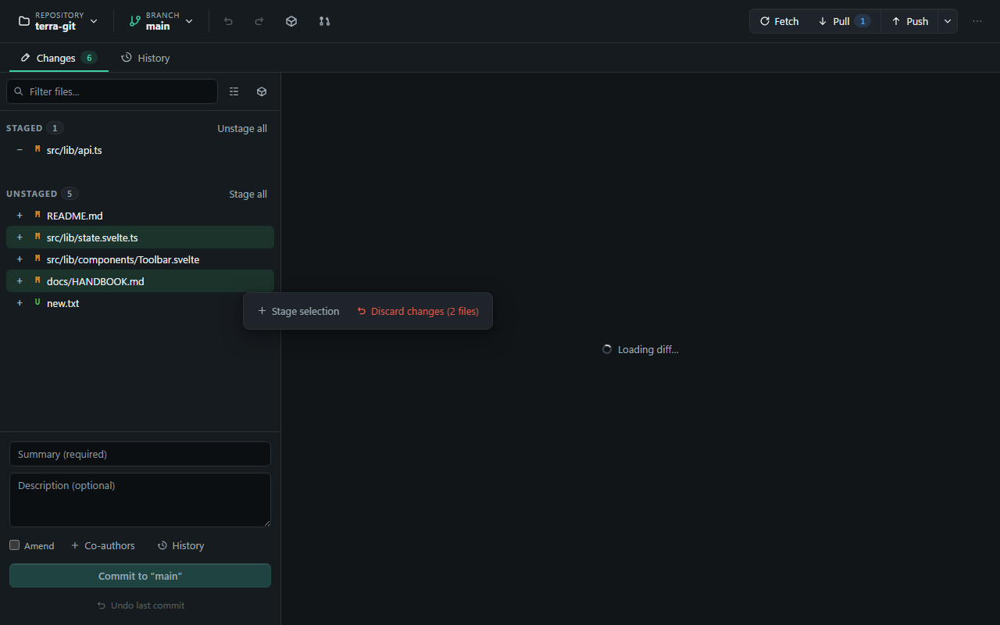

Right-clicking anywhere else does nothing on purpose: terra-git switches the
browser-style context menu off across the whole app. The exception is text
fields, which get their own **Cut** / **Copy** / **Paste** / **Select all**
menu.

**The changes overview.** While no file is selected, the diff area shows
all pending changes at a glance: a dot per row marks whether the file is
fully, partially, or not yet staged, and a square-root-scaled bar shows the
size of each change. The overview is fully keyboard-driven — arrows move,
`Space` stages/unstages, `Enter` opens the diff, `Ctrl+Enter` commits (it
only jumps to the summary field when the commit is not ready yet — no
summary written, or nothing staged) — and if the repository's message log
follows Conventional Commits, a hint shows the types you use most.

**Committing.** Write a summary (required) and an optional description,
then commit. **Amend** replaces the last commit instead of creating a new
one; terra-git warns if that commit has already been pushed. **Co-authors**
adds `Co-authored-by:` trailers. A **commit-message history** (last 30
messages, per repository) is one click away from the commit box. **Undo
last commit** appears right under the button and performs a safe soft
reset.

The commit box explains itself rather than just refusing. A counter beside
the summary warns that *Subject lines over 72 characters get truncated on
some platforms* — advice, not an error; the commit goes through either way.
And a greyed-out commit button says what is missing when you hover it:
*Enter a summary.*, *Stage changes first (+ on a file, or Stage all) — or
choose Amend.*, or *An operation is running — please wait.*

**Push, pull, fetch.** The toolbar buttons cover the usual flow; the push
button's dropdown adds push-to-a-specific-remote and force-push
(`--force-with-lease`) after a rebase. A progress bar appears under the
toolbar during any remote operation, with a status line above it naming
the operation, the current phase and the percentage; fetch, pull and push
also get a cancel button. The bar keeps visibly alive even when Git itself
goes quiet for a moment: the sheen on the fill runs even while the fill
stands still, so a bar that is not advancing does not mean a crash —
usually the remote side is simply busy.

**Staying current.** There is no refresh button because you do not need
one: terra-git watches the repository on disk and re-reads the status when
something changes, with a periodic check as a fallback. Editing files in
your editor while terra-git is open is fine. If a list ever does look stale,
`F5` or `Ctrl+R` re-reads the status — those keys are repurposed
deliberately and do not reload the window.

## Reading diffs

The diff area behaves the same in both tabs, with three deliberate
differences.

**Unified or side-by-side.** The toggle is the icon button in the header
above a selected commit's diff **in the History tab only** — its tooltip
reads *View: split* while you are in unified and *View: unified* while you
are in split. The Changes tab's diff is always unified, because that is the
view in which you stage individual hunks and lines and a split layout would
have nowhere to put the controls. The choice is remembered between sessions;
unified is the default. Common languages get syntax highlighting in both.

**Staging hunks and lines.** In the Changes tab, hunk headers carry a
`+ Stage` / `− Unstage` button (its tooltip spells it out as *Stage hunk* /
*Unstage hunk*); on the unstaged side there is also **Discard hunk**.
For finer work, click the numbers themselves — that is the click target, and
you can select several.
As soon as something is selected, a **Stage 1 line** / **Stage n lines**
button (or **Unstage …** on the staged side) appears in that file's header,
next to **Clear**, which drops the selection again.

**Searching inside a diff.** `Ctrl+F` opens a compact bar over the view and
filters as you type; the counter to its right shows *current/total*, or
*0 matches* in red when nothing hits. `Enter` and `Shift+Enter` step forward
and back, as do the two chevron buttons and `F3` / `Shift+F3`; the view
scrolls the current hit into the middle and tints it. `Ctrl+G` switches the
same bar to line-number mode — type a line number, press `Enter`, and the
diff jumps there. Switching between the two modes clears the field. **Close
(Esc)** or the `×` closes the bar.

Exactly one view answers the shortcut at a time, which is worth knowing
because it otherwise looks arbitrary: while a dialog containing a diff or a
blame view is open, that one takes the search and the main diff behind it
stays silent; with no dialog open, the main diff takes it.

**Images and other binaries.** In the Changes tab, image files get an actual
before/after image diff — that is the second thing the History tab does not
do; a changed image selected inside a commit falls back to the size
comparison below. Other binary files show a byte-size comparison (old size
→ new size, with the delta) instead of a raw content diff — a full hex diff
was deliberately left out as a niche, expensive feature.

**Files listed as changed with an empty diff.** Occasionally Git reports a
file as modified while the diff shows nothing at all. Rather than leaving
you with a bare "no content changes", terra-git works out why and says so:

- **Line endings only** — the content matches, but the working copy uses
  different line endings (LF/CRLF) than the repository holds, or than a
  checkout would write. The view names both sides so you can see which is
  which.
- **Executable bit only** — identical content, only the file mode changed
  (`100644` → `100755`). Mostly relevant on Linux and macOS.
- **No difference** — content and line endings both match. Git is reporting
  the file because of stale index information; it usually clears itself on
  the next access.
- **No content difference** — the fallback when no harmless cause can be
  established. terra-git says so plainly rather than guessing, because the
  one thing worse than an unexplained file is a real change labelled
  harmless.

Binary files are excluded from this check: they also produce an empty diff,
and a byte change must never be dressed up as a line-ending issue.

Very large diffs are cut off rather than allowed to freeze the window; the
view says where it stopped.

### Blame

Two ways in, both in the Changes tab: the `⋯` menu of a file row → **Show
blame**, or the eye button in the diff header. Either opens a dialog titled
**Blame — file**.

Consecutive lines from the same commit form one block with a header carrying
the author (with an initials avatar), how long ago, and the short commit ID.
The legend in the view states the colour scheme: *Consecutive lines from the
same commit form a block — bar color = author, the paler the bar, the older
the change.* Source lines keep their syntax highlighting and their real line
numbers, and `Ctrl+F` / `Ctrl+G` work inside the view.

Two behaviours are worth stating rather than leaving you to guess. Blame
always describes the committed state, not your working copy — a file you
have edited but not committed still blames the last committed version, and a
file that has never been committed refuses outright (*“file” is not
committed yet — blame is not available*). And only the first 5000 lines of a
file are blamed.

## History

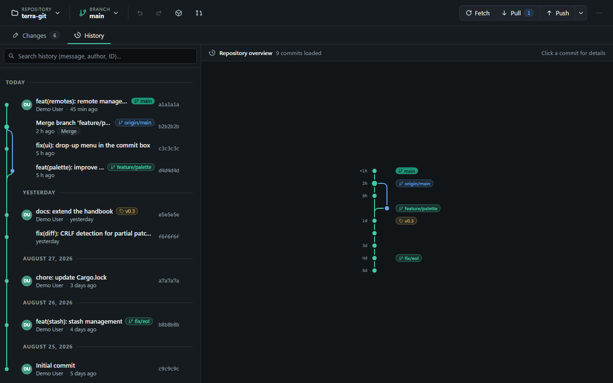

The History tab shows the **whole repository**, GitLab-style: all local and
remote branches and tags in one topological graph with colored lanes and
merge curves — not just the current branch. Branch tips carry badges
(current branch highlighted, remote branches in blue, tags in ochre), the
author is only repeated when it changes, and the short commit ID sits
quietly at the right edge. The search box filters by commit message,
author, or commit ID and also searches across all branches.

While no commit is selected, the right side shows a **repository
overview**: the same graph drawn large and vertical, the newest commit at
the top and the history sinking downwards, with an age scale down the left
edge (`<1h`, `2h`, `3d`) and the branch and tag badges in a column on the
right. Click any dot to select that commit. Selecting a commit (here or in
the list) shows every file it touched with a per-file diff.

**History loads in pages.** The end of the list carries a **Load more…**
button, and scrolling near the end loads the next page by itself — so a
commit you cannot find may simply not be loaded yet rather than missing.
Searching drives further loading too. The first time you open a very large
repository you may see *Preparing history for this large repository — the
first load may take a moment.*; that is a one-time pass. A commit that
touches an enormous number of files has its file list capped, and says so:
*Large commit: showing 200 of 4000 files.*

### The commit action menu

Every commit row carries a `⋯` button (*Commit actions*) — the densest menu
in the app:

- **Cherry-pick onto current branch** — applies just that commit on top of
  where you are.
- **Cherry-pick onto another branch…** — the dialog says what it will do:
  *Switches to the selected branch and applies the commit there. On
  conflicts, the conflict view takes over.*
- **Revert commit** — creates a new commit that undoes it. Nothing is
  rewritten, so this is the safe choice for history that is already pushed.
- **Create branch from here…** — a new branch at that commit. Apart from
  Cancel, the only
  button is **Create & check out**, so terra-git always switches you to the
  new branch; there is no create-without-switching option.
- **Create tag here…** — see [Tags](#tags).
- **Check out here (detached)** — see below.
- **Bisect: from here (good) to HEAD (bad)** — see [The bisect
  assistant](#the-bisect-assistant).
- **Squash last n commits…** and **Interactive rebase from here…** — see
  [Rewriting history safely](#rewriting-history-safely). Both appear only on
  a commit below the top row, when HEAD is the newest commit in the list and
  the range from HEAD down to that commit is linear, and only while you are
  not filtering the list with a search — neither rewrite can cross a merge
  commit, and neither can start at HEAD itself.
- **Copy commit ID**.

Cherry-pick, revert and the two rewrites all land as single steps in the
[undo stack](#undo-and-redo).

**Detached HEAD.** *Check out here (detached)* puts your working directory
at that commit without standing on any branch — the branch button then reads
**HEAD (detached)**. It is fine for looking around and building, but commits
you make there belong to no branch, and a few actions refuse until you are
back on one (creating a pull request, for instance, says *No branch checked
out (detached HEAD) — check out a branch first.*). The way back is to pick a
branch from the branch menu; if you made something worth keeping, use
**Create branch from here…** first.

### The bisect assistant

Binary search for the commit that introduced a bug, without dropping to the
command line. In the History tab, open the `⋯` action menu of a commit you
know was still good and choose **Bisect: from here (good) to HEAD (bad)**.
terra-git checks out a commit halfway between the two and puts a banner
across the top of the window: it names the commit you are looking at right
now (short ID and subject) and roughly how many steps are left. Test that
state, then answer **Good**, **Bad**, or — when this particular commit
cannot be tested at all — **Skip**; each answer halves the remaining range
and checks out the next candidate. Once only one commit is left, the banner
names it as the **First bad commit**. **Finish** ends the session and
returns you to the branch you started from; **Abort** does the same at any
earlier point.

## Branches & merging

The branch button in the toolbar opens the branch list. A **Filter
branches…** field sits at the top, which earns its keep in a repository with
many branches, and a name field at the bottom creates a new branch.

Entries carry badges: **current** for the one you are on, **remote** for
remote branches — they are listed too, so checking out a colleague's branch
is one click — and **orphaned** for a local branch whose upstream is gone,
with the tooltip *Upstream deleted on the remote (e.g. after merge). Safe to
delete.* That badge is the visible half of the **Auto-clean orphaned
branches on pull** setting; with the setting off, terra-git only marks them
and leaves the deleting to you.

Per entry you get **Merge into current branch**, and for local branches also
**Rebase current branch onto this**, **Rename** and **Delete**. Deleting
checks whether the branch is merged first and asks again before
force-deleting an unmerged one. Conflicts from a merge or rebase open the
conflict banner — see [Resolving conflicts](#resolving-conflicts).

**Switching with uncommitted changes.** If you still have uncommitted work
when you switch, terra-git asks where it belongs instead of deciding for you:

- **Bring to `<target>`** — the changes move with you. Where git can do that
  directly it does, untouched; only if one of your files also differs on the
  target branch do they take the detour through a stash (stash, switch,
  re-apply). If re-applying runs into real conflicts, your work stays safely
  in the stash and the message points you to the stash list.
- **Leave on `<source>`** — the changes are stashed, including untracked
  files. They come back **automatically** the next time you switch to that
  branch, as long as your working tree is clean at that moment; otherwise
  they stay in the stash list and terra-git says so. Such a stash is labelled
  *Left behind when switching away from …* in the stash list, and you can
  apply, preview, or drop it by hand like any other.

The question only appears while no multi-step operation (merge, rebase,
cherry-pick) is running — git refuses to switch during those anyway.

## Resolving conflicts

terra-git offers three surfaces for the same job, and knowing which is which
saves a lot of hunting. All three write the same result, so moving between
them in the middle of a conflict is perfectly fine.

**The banner** is a status strip across the top of the workspace: it names
the operation (*Merge in progress*, *Rebase in progress*, …) and how many
files are still conflicted, and it is where you finally press **Continue**
or **Abort**. With conflicts still open it also offers **Open workshop**,
and **Continue** stays disabled until nothing is left. The banner belongs to
the Changes/History workspace and is not shown inside the workshop.

**The changes list** is the quick route for a single file. A conflicted row
carries **Resolve** (tooltip *Resolve in conflict editor*), **Mine**,
**Theirs** and an external-tool icon (*Open in merge tool*). **Mine** and
**Theirs** take that whole file from one side in one click; the icon hands
it to the merge tool you configured in Git.

**Resolve** opens the conflict editor for that one file — a dialog titled
*Resolve conflict — file*. You work segment by segment rather than on the
file as a whole: each conflicting segment shows both sides side by side
(plus **Base**, where git recorded a common ancestor), with the buttons
**Mine**, **Incoming**, **Both (mine first)** and **Both (incoming first)**.
Segments you have not answered yet say *Still open — choose an option*. The
part nobody finds by accident: the result of each segment appears as an
editable text box, so you can type the merged version yourself instead of
picking a side. A counter tracks *3 of 7 conflicts resolved*, and **Resolve
& stage** writes the file and stages it in one step. If the file turns out
to be fixed already you get *No conflict markers found — the file has
probably already been resolved.*

### The conflict workshop

The **conflict workshop** is the guided way through all the files at once.
Four ways in, whichever you meet first: the button on the conflict banner,
the **`…` menu → Tools → Conflict workshop**, the command palette, and the
**Open conflict workshop** button on the error message you get when a pull
or merge ends in conflicts.

It opens as a full view. The header names the operation, adds a **Step 2 of
5** chip during a rebase, names the commit being applied (*Current commit:
“…”*), and carries **Back to workspace**, **Abort** and **Continue**. Under
the title a plain-language subtitle says what you are doing — for example
*You are merging feature/x into main — for each conflict, choose which
version applies.*

The left column splits the files into **Open conflicts** and **Resolved**,
with a bar above tracking *2 of 5 files resolved* for the session. You never
have to hunt for the next file: the selection moves on by itself as each one
is finished.

For the selected file you have three levels of attack. **Whole file:
<side>** takes one side outright — the button is labelled with the real
branch or commit name, not "ours". **Open mergetool** hands the file to your
external tool. Or you work block by block: each block is headed **Conflict 2
of 4**, shows both sides (and the base where one exists), and offers the two
sides plus **Both (left first)** and **Both (right first)** — and, again, an
editable box with the result once you have chosen. **Resolve & stage** only
lights up once every block in that file has an answer; it writes the file,
stages it, and keeps the file's existing line endings.

**Continue** in the header stays disabled while any file is still open. Once
nothing is left, the main area reads *All conflicts resolved.* / *You can
continue the operation now.* When the operation ends — continued or aborted
— the workshop returns you to the workspace by itself. **Back to workspace**
leaves without giving anything up.

**The reversed sides of a rebase.** This is the most common way to resolve a
conflict backwards, so it deserves its own paragraph. In a merge, the left
side is your branch and the right side is what is coming in. In a rebase,
git replays your commits onto the other branch, so the left side is the
**new base** and the right side is **your own commit**. terra-git therefore
never prints "ours" and "theirs" here: it prints the branch or commit name,
labels the columns *Base (main)* and *Your commit (feature/x)*, and puts a
warning under the subtitle — *During a rebase the sides are swapped: the
left side is the new base (main); your change is on the right.* Cherry-pick
and revert are labelled the same way, as *Current state (…)* against
*Commit (…)*.

## Rewriting history safely

Everything in this chapter changes commits that already exist. Three things
make that survivable: a backup is written before every rewrite that discards commits, most
operations land as one step in the undo stack, and the commit workshop
refuses to touch anything that has already been pushed.

### Amend and undo last commit

The two smallest rewrites live in the commit box. **Amend** replaces the
last commit — with a warning when it has already been pushed, since that
forces a force push afterwards. **Undo last commit** dissolves it and puts
its changes back into the staging area. Apart from an empty repository
(*There is no commit to amend.*), **Amend** is refused only while a
merge, rebase, cherry-pick or revert is running (*Not possible while an
operation is running — continue or abort it first*). **Undo last commit**
additionally refuses on a merge commit and on the repository's very first
commit.

### Squash last n commits

In the History tab, a commit's `⋯` menu → **Squash last n commits…** folds
that commit and everything above it into a single commit. Type the new
message — the **Squash** button stays disabled until you do. The dialog
states the consequence itself: *The last n commits will be combined into a
single commit. Already pushed commits will require a force push
afterwards.* A backup is written first, and the whole squash is one undo
step.

### Interactive rebase

A commit's `⋯` menu → **Interactive rebase from here…** opens a dialog
covering that commit and everything above it up to HEAD. Each row gets one
action from a dropdown:

| Action | What it does |
| --- | --- |
| Pick | Keep the commit unchanged |
| Reword | Keep the commit but edit its message (a text field appears on the row) |
| Squash | Meld into the previous commit (combine messages) |
| Fixup | Like squash, but discard this message |
| Drop | Remove the commit |

The difference between squash and fixup is exactly that last line: fixup
throws the commit's own message away instead of combining it.

Rows are reordered by dragging or with the **Move up** / **Move down**
buttons, and the single keys `p`, `r`, `s`, `f` and `d` set the action on
the focused row. One thing runs opposite to the History list and catches
people out: **the plan is in application order — the topmost row is applied
first, so it is the oldest commit.** The dialog's own hint says the rest:
*Reorder by dragging or with the arrow buttons and choose an action per
commit (the topmost is applied first). Already pushed commits will require a
force push afterwards; on conflicts the conflict view opens.*

Three warnings can appear above the buttons. Two of them block the run: *The
first kept commit cannot be "squash"/"fixup" — it needs a predecessor. Move
a "pick" to the top.* and *Reword requires a new commit message.* The third
is information only: *All commits will be removed — the branch tip will be
reset to its parent.*

A backup is written before the rewrite, so the previous state stays
reachable through the Backups dialog. If the rebase stops on a conflict the
dialog closes and the banner and conflict workshop take over; continuing
past the last conflict finishes it. And the plain consequence: commits that
were already pushed come back with new IDs, so the next push has to be
**Force push (--force-with-lease)** from the push button's dropdown. That
entry asks first — *Force push (--force-with-lease) to “origin”? This
overwrites the remote branch with your local history.* — and it names the
remote it is actually going to push to.

### The commit workshop

The commit workshop is the safe half of the same idea: it only ever touches
commits that are **not yet on any remote**, so no force push can follow. Get
there from the toolbar's **Commit workshop** button (it appears whenever the
branch is ahead of its remote or has no upstream at all), from the `…` menu
→ **Tools** → **Commit workshop**, or from the palette entry *Edit unpushed
commits*. It opens as a full view; **Back** returns.

The list holds every unpushed commit, newest first, with HEAD at the top
carrying a **HEAD** tag and a count badge (*4 unpushed*). Below the list a
plinth shows the upstream name and the words **already pushed** — everything
under that line is out of reach. In a repository with no remote at all
nothing counts as pushed, so the list runs all the way down to the root
commit. The subtitle states the point: *These commits haven't been pushed
yet — you can still safely edit messages and authors, or drop individual
commits.* With nothing to do it reads *All pushed* / *As soon as local
commits are ahead of the remote, they show up here.*

**Editing a commit.** Click a row to expand it — HEAD is already open,
because correcting the last message is the common case. The form holds
**Subject**, **Description**, **Co-authors (comma-separated)** (the same
syntax as the commit box), **Author name** and **Author email**. A commit
you have touched is tagged **edited**. Author fields are validated: name and
email must be non-empty and free of angle brackets, or the card is flagged
and *Invalid author: name and email must not be empty and must not contain
angle brackets (< >)* blocks the rewrite. The fields grey out on a commit
you have dropped or squashed, since its own message no longer matters.

**Restructuring.** Icon buttons on each row cover three more rewrites:
**Move up** / **Move down** reorder (there is no drag-and-drop here — that
is the interactive-rebase dialog); a merge icon, **Squash into the older
commit**, folds a commit into the row below it and tags it **squashed**, and
the same button undoes it; a trash icon, **Drop commit**, greys the commit
out and tags it **dropped**, and restores it again. Squash is disabled when
there is no older non-root commit beneath the row, and the oldest kept
commit cannot be a squash — it has nothing to fall into — which the workshop
says before it lets you apply. A changed order shows as an **Order changed**
tag in the footer.

**Nothing happens as you type.** Edits queue up, the footer counts
*Pending: 3*, and only **Rewrite commits** applies them; **Reset** throws
the whole queue away and reloads. That is what makes the view safe to
experiment in. **Reload** re-reads the commits without discarding what you
have already typed.

The whole unpushed range is rewritten in one pass — deliberately, because a
partial plan could silently drop commits — after a backup of the previous
state is written (the footer says so: *A backup is created automatically
before rewriting.*). Success reports *Commits rewritten*. If the rewrite
hits a conflict, the workshop closes and the conflict banner takes over; if
it fails for another reason, the workshop stays open with your edits intact.

Two kinds of commit are protected and carry a lock: merge commits (*Merge
commit — not editable*) and the repository's root commit, tagged **root**
and pinned to the bottom (*The root commit can't be edited in this
version*). A merge commit anywhere in the range blocks the entire rewrite,
with the banner *Range contains merge commits — not editable* and the button
disabled.

**Uncommit.** Expanding the topmost commit also reveals **Uncommit (back to
staging)**: it dissolves the last commit and puts its changes back into the
staging area (*Top commit undone — changes are staged again*) — the same
safe soft reset as **Undo last commit** under the commit box, offered where
you are already inspecting that commit. It closes the workshop and returns
you to the workspace, with the changes waiting staged.

### Undo and redo

The two arrow buttons in the toolbar are not a single-step undo. They drive
a stack of up to 50 steps per repository, so you can walk several operations
back and forward again. The tooltip names the exact step you are about to
reverse (*Undo: Interactive rebase (Ctrl+Z)*), and the confirmation repeats
it (*Undone: Interactive rebase*). With nothing on the stack the tooltip
reads *Nothing to undo* / *Nothing to redo*. The same commands sit in the
palette; the keys are `Ctrl+Z` and `Ctrl+Y` (`Ctrl+Shift+Z` works too).

These operations are recorded, under the names the app shows: Commit, Amend,
Commit undo, Merge, Rebase onto, Interactive rebase, Squash, Cherry-pick,
Revert, Branch switch to, Branch deletion, Stash drop, Backup restore. So
undo can bring back a deleted branch or a dropped stash, not just move a
branch tip — worth knowing, because it changes how boldly you can act.
Starting a new operation clears the redo side.

Two limits: the shortcuts are ignored while you are typing in a text field
(where the normal text undo applies) and while a dialog is open, because a
repository-wide undo in either place would be a nasty surprise. And the
stack lives only as long as the app session — close terra-git and it is
gone. The durable safety net is the backups below.

**When undo refuses.** It is deliberately conservative, and says no in four
situations:

- while a merge, rebase, cherry-pick or revert is running — finish or abort
  it first;
- when you have switched branches since: an undo only runs on the branch the
  operation happened on;
- when the branch has moved on since — *The branch has changed in the
  meantime — this step can no longer be undone safely.* That is a safety
  stop, not a bug;
- for the steps that undo by resetting the branch hard, when the working
  directory holds uncommitted changes — stash or discard them first
  (untracked files are not in the way).

The reason behind all four is the same: an undo must never be the thing that
throws work away.

### Backups before history rewrites

Before a history rewrite, terra-git anchors the state it is about to replace
as a real reference. That is the point of doing it this way rather than
relying on the reflog: a reference survives garbage collection and reflog
expiry, so an old state is still recoverable weeks later.

Backups are written before a **squash**, a **rebase onto another branch**,
an **interactive rebase** (from the History dialog and from the commit
workshop's *Rewrite commits* alike), an **amend**, and before a **restore**
itself. Merge, cherry-pick and revert are not backed up — those are covered
by the undo stack.

What is saved is the committed state of the branch tip, and nothing else.
Uncommitted work is never in a backup, which is exactly why restoring
insists on a clean working directory.

**The Backups dialog** (`…` menu → **Manage** → **Backups…**) is headed
*Backups (before history rewrites)* and states the rule itself: *Before every
squash/rebase, terra-git automatically saves a backup of the previous state.
"Restore" hard-resets the current branch to it — the current state is backed
up as well.*

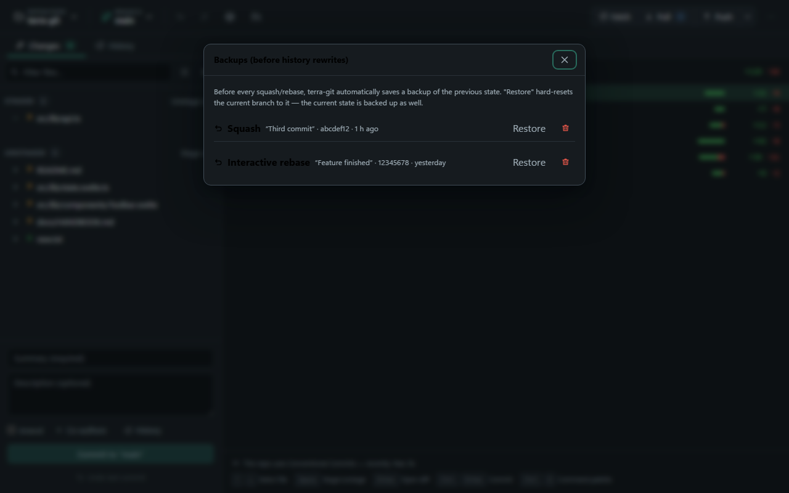

Each row names the operation that caused it (Squash, Rebase, Interactive
rebase, Restore — an amend backup is listed under its raw name `amend`),
the subject and short ID of the state it holds, and how long ago it was
taken, newest first — that is how you recognise the state you want back.

**Restore** (hover: *Hard-reset the branch to this backup*) asks first, and
the confirmation spells out the whole deal: *Hard-reset the branch to
"subject" (id)? Your working directory must be clean for this. The current
committed state is saved as a new backup first.* So a wrong restore is one
more restore away from being undone, a **Restore** entry appearing in the
list afterwards is normal rather than a bug, and the restore itself is one
undo step. It is refused while the working directory is dirty and while a
merge or rebase is running.

The trash button deletes a backup permanently (*Delete backup "Squash"
permanently?*) and is the one irreversible thing in this dialog — afterwards
the old state is only findable through git's own reflog, if it is still
there. Nothing expires on its own, so this is also where you tidy up once a
rewrite has proven good. Empty, the dialog reads *No backups yet — they are
created automatically before squash/rebase.*

## Stashing and parking work

terra-git has a full stash manager, not GitHub Desktop's single implicit
stash. Reach it from the stash icon in the toolbar (*Manage stashes*) or
from the palette.

**Stash all changes…** — the package icon above the changes lists, or
**Stash changes…** in the palette — takes an optional message and saves
everything, untracked files included, resetting the working directory to the
last commit. A single file can be stashed on its own from the `⋯` menu of
its row in the changes list.

Each entry in the list offers four things. The eye icon (**View contents**)
opens a preview. **Apply** (*Apply (keep)*) puts the changes back and leaves
the stash in the list; **Pop** (*Apply & remove*) puts them back and deletes
the entry — that is the whole difference, and it is the thing people
hesitate over. The trash icon discards a stash after a confirmation, and
that drop is undoable from the toolbar.

Two details about the preview: it shows the stash's changes against its base
and, as the dialog says, *Untracked files are not included in the preview* —
so an empty-looking preview does not mean an empty stash.

Stashes that terra-git created for you when you switched branches show up as
*Left behind when switching away from “name”* instead of under a message you
wrote; see [Branches & merging](#branches--merging) for how those come back
on their own.

## Remotes, pull and merge requests

### Manage remotes

`…` menu → **Manage** → **Manage remotes…**, the push button's dropdown, or
the command palette. Adding, renaming, changing a URL and removing a remote
are all here — a gap in GitHub Desktop itself.

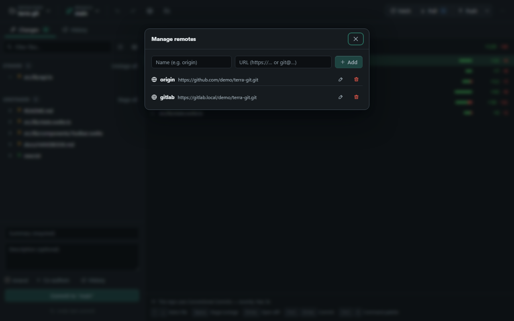

The top row adds a remote from a name (*Name (e.g. origin)*) and a URL
(*URL (https://… or git@…)*); `Enter` in the URL field adds it. Each row has
a pencil (*Rename / change URL*) that turns the row into two editable fields
you confirm with **Save** or `Enter`, and a trash button whose confirmation
states the consequence precisely: *Remove remote "origin"? Local branches
are kept; the remote-tracking references (origin/…) will be deleted.* A
repository with no remote at all gets a hint pointing at `origin` and
explaining that a remote is what enables push and pull.

Because **Manage remotes…** also sits in the push dropdown, you can fix a
wrong URL at the moment a push fails.

### The pull/merge request list

Open it from the toolbar button labelled **Show Pull Requests** or **Show
Merge Requests** — the wording follows the provider — or from the same entry
in the command palette. The dialog is titled after the host it queried.

Each row shows a coloured CI dot (hover: *CI: passed*, *CI: failed*,
*CI: running*, *CI: pending*, *CI: canceled*, *CI: no status*), the number,
the title with a **Draft** badge where applicable, and then author · source
branch → target branch · when it was last updated. Clicking a row opens it
in your browser. The list holds open requests only, most recently updated
first — up to 50, with the CI status looked up for the first 25; the rest
read *CI: no status*.

Which host is asked follows the repository's remote. A repository whose
remote points at a host you have not connected shows *No account is set up
for this remote. Connect a token in Settings.*, with the host itself printed
underneath as the error detail and a **Connect account…** button. A
repository with no recognisable provider remote shows *This repository has
no remote pointing to a supported provider.*

GitHub (including GitHub Enterprise Server), GitLab (including self-hosted
and subpath installations) and Gitea/Forgejo (including Codeberg) each have
a real API integration behind this. Bitbucket is not supported — see
[../ROADMAP.md](../ROADMAP.md).

### Creating one from the app

**Create…** in the list, or the palette entry **Create Pull Request** /
**Create Merge Request**.

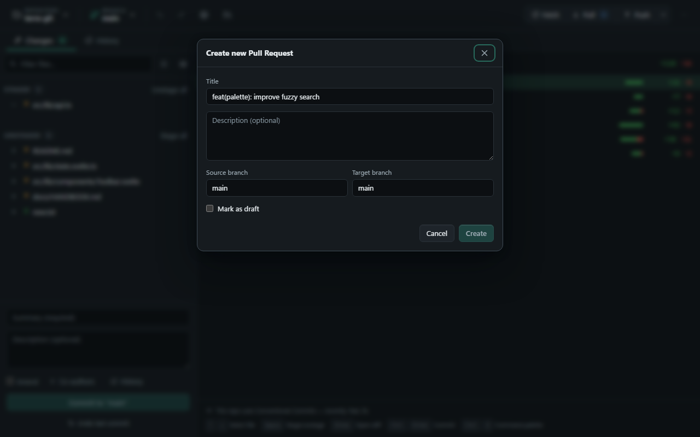

Two preconditions are where people get stuck, and the dialog names both: you
need a branch checked out (*No branch checked out (detached HEAD) — check
out a branch first.*) and that branch must already exist on the remote (*The
current branch has no upstream yet — push first so the provider knows it.*).
So the usual order is push, then create.

**Source branch** is fixed to the branch you are on and cannot be edited.
**Target branch** is pre-filled with the project's default branch as the
provider reports it, and **Title** with your newest commit's summary; there
is a **Description (optional)** box and a **Mark as draft** checkbox.
**Create** stays disabled while the title is empty or the target equals the
source. On success you get *Pull Request #42 created — opening in browser*
and the new request opens in your browser.

**Create in browser…** in the list skips the API entirely and opens the
provider's own compare / new-merge-request page for the current branch —
which is the fallback when you have no token for that host.

### Unknown SSH hosts

terra-git delegates the SSH connection to your system's own SSH
client/agent, but it handles the host key itself. The first time you talk to
a new host — on fetch, pull, push **or clone** — a dialog titled **Unknown
SSH host** shows the host's fingerprints and offers **Trust & continue**, or
**Replace old entry & continue** when `known_hosts` already holds a
different key for it. Confirming reports *Host added to known_hosts* and the
operation that ran into the key is repeated automatically, so there is
nothing to click twice; a clone simply resumes.

The second case is the one to stop at: *Warning: a different known_hosts
entry already exists for this host. This can indicate a man-in-the-middle
attack — when in doubt, cancel and verify the fingerprint through another
channel.* Verify the fingerprint elsewhere before you accept it.

If OpenSSH (`ssh-keyscan`/`ssh-keygen`) is not installed, terra-git says so
instead of showing a fingerprint.

## Testing pipelines locally

`…` menu → **Tools** → **Test pipeline locally…** (the same entry is in the
command palette) opens a full-window view titled **Test pipeline locally**,
with **Back** at the top left. The point is to run your CI jobs on your own
machine before pushing, so a broken pipeline is not discovered by the remote
runner.

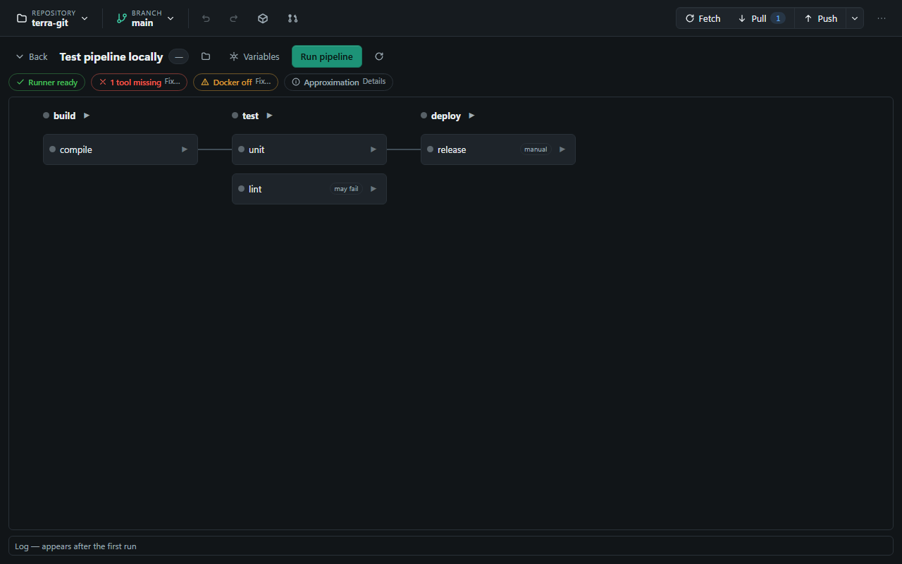

**Which configuration is used.** terra-git looks for `.gitlab-ci.yml` first,
then other YAML files in the repository root and in `.gitlab/` that look
like GitLab CI, then every `.github/workflows/*.yml` or `*.yaml`. When more
than one turns up, a dropdown in the header picks between them, and
switching resets the graph, statuses and logs. The folder button (*Choose CI
file…*, which opens a picker titled *Choose CI configuration file*) is
always there, so you can point at a file the scan does not reach; it has to
lie inside the repository, be a `.yml`/`.yaml`, and match the provider it is
filed under. With nothing found at all the view reads *No CI configuration
found (.gitlab-ci.yml or .github/workflows).*

**Prerequisites** appear as status chips once a configuration is selected —
*Runner ready* / *Runner missing*, *Tools complete* / *n tools missing*
(GitLab only), *Docker running* / *Docker off* — plus an *Approximation*
note that is always present. Blocking problems open a **Fix…** expander with
the actual instructions; the note opens under **Details**. The check runs
when you enter the view and again on every run, and the Docker chip carries
a **Check again** button, so starting Docker afterwards does not leave you
with a stale warning. Local runs are only an approximation: secrets, runner
tags, services and caches differ from a real CI runner.

The runner is needed to *display* the graph, not merely to run it —
terra-git asks the runner itself for the job list. Without it you get *Could
not read the pipeline configuration* and a **Retry** button rather than a
graph.

**Starting a run** has three scopes:

- **Run pipeline** in the header runs every job in the graph.
- The ▶ on a stage heading runs that stage — and, because the runner is
  called with `--needs`, the earlier jobs that stage depends on. Stage runs
  are GitLab-only, which is why GitHub Actions graphs have no ▶ on their
  stage headings.
- The ▶ on a job node runs that one job (plus what it needs). Running a
  single job is, for most people, the whole reason the feature exists.

Only one run per repository at a time; a second start is refused with *A
pipeline run is already active in this repository — cancel it or wait for it
to finish.* While a run is going, the header button becomes **Cancel**,
which stops the whole process tree, and the run buttons, the config
selector, **Reload** and the variable fields are all disabled. A run gives
up after 30 minutes with *Pipeline run aborted: time limit reached.* GitLab
jobs marked `when: manual` are started deliberately when they fall inside
the scope you ran — otherwise the runner would skip them and a click on a
manual job would appear to do nothing.

**Reading the graph.** Columns are the stages, left to right; the curved
lines are `needs` edges (a line that loops back at the left edge is a
dependency inside the same stage, which GitLab allows). The dot on each node
and stage heading is that job's live status, and the badge next to the view
title rolls the whole run up — it deliberately shows *running*, *failed* or
*pending* before *success*, so a single-job run does not paint the whole
pipeline green. A job with `when: manual` is tagged **manual**, one with
`allow_failure` is tagged **may fail**.

**The log drawer** stays a slim bar reading *Log — appears after the first
run* until you run something. Click a job node to point the drawer at that
job's output; **Full log** switches back to the interleaved log of the whole
run. The log auto-scrolls only while you are already reading near the
bottom, so scrolling back to inspect a failure is not yanked away, and each
drawer keeps the last 2000 lines. A run ends with *Finished: success (exit
0)*, *Finished: failed (exit 3)* or *Canceled*.

**CI variables.** The **Variables** button opens a **CI variables** panel of
KEY/Value rows with **Add variable** and a per-row remove; a count appears
on the button when any are set. They apply to the next run, and to both
runners. The panel states why it works the way it does — *Values are passed
to the runner via a temporary file, never on the command line* — which is
what keeps a secret out of the process list. Keys must look like environment
variables (a letter or underscore first, then letters, digits and
underscores); rows with an empty or malformed key are simply dropped.

**Trigger event.** For GitHub Actions only, a dropdown picks which event
`act` simulates — push, pull_request, workflow_dispatch or tag. Its tooltip
says the rest: *act trigger event for this run (GitHub/act only; GitLab has
no events).* GitLab has no such concept, so the dropdown is absent there.

## Repository maintenance

### Tags

`…` menu → **Manage** → **Manage tags…** opens the **Tags** dialog. The top
row takes a tag name and an optional message, and the button is **On HEAD** —
it tags the commit you are on. To tag any other commit, use that commit's
`⋯` menu in the History tab → **Create tag here…**.

The message field decides what kind of tag you get, and the placeholder says
so: *Message (optional = lightweight)*. Leave it empty for a lightweight
tag, type something for an annotated one. The list shows each tag with its
message — or the word *lightweight* — and the short ID of the commit it
points at, with a trash button to delete it. Empty, it reads *No tags yet.*

Tags appear as ochre badges in the History graph and as an ochre ring in the
start screen's sketch. Creating and deleting tags is local: pushing tags to
a remote is not offered in the app.

### Submodules

`…` menu → **Manage** → **Submodules…** lists each submodule with its name,
path and URL. The dialog is read-only apart from **Update all**, which runs
`git submodule update --init --recursive` — and warns that this can take a
while for large submodules. Adding or removing a submodule is not offered
here. With none present it says *This repository has no submodules.*

### Worktrees

`…` menu → **Manage** → **Worktrees…** (also in the palette). The dialog's
own hint explains what they are for: *Worktrees check out multiple branches
of the same repository into separate directories in parallel — without
cloning again.*

Each row shows the checked-out branch (or *detached HEAD* plus the short
ID), the path, and a badge — **current** for the one you have open, **main**
for the repository's main worktree. Any other worktree gets an **Open**
button (*Open this worktree as a repository*), which switches **this**
window over to it; the current repository is replaced, so use **New window**
first if you want both side by side. The trash button appears only for
worktrees that are neither the main one nor the current one, and confirms
with *Remove worktree "path"? The directory will be deleted; the branch is
kept.* It fails if that worktree still holds uncommitted changes, because
git refuses to remove a dirty worktree.

**Create new worktree** takes an **existing** local branch from a dropdown —
you cannot create a branch here — plus a parent folder and a name. The name
follows the chosen branch with slashes turned into `-` until you edit it,
and *Will be created at:* shows the resulting path before you press
**Create**. The dropdown only offers branches that are not already checked
out somewhere, and says why: *Each branch can only be checked out in one
worktree.* With none left: *No available local branch — each branch can only
be checked out in one worktree.*

### Sparse checkout

`…` menu → **Manage** → **Sparse checkout…** restricts the working directory
to selected folders (cone mode); handy for large monorepos.

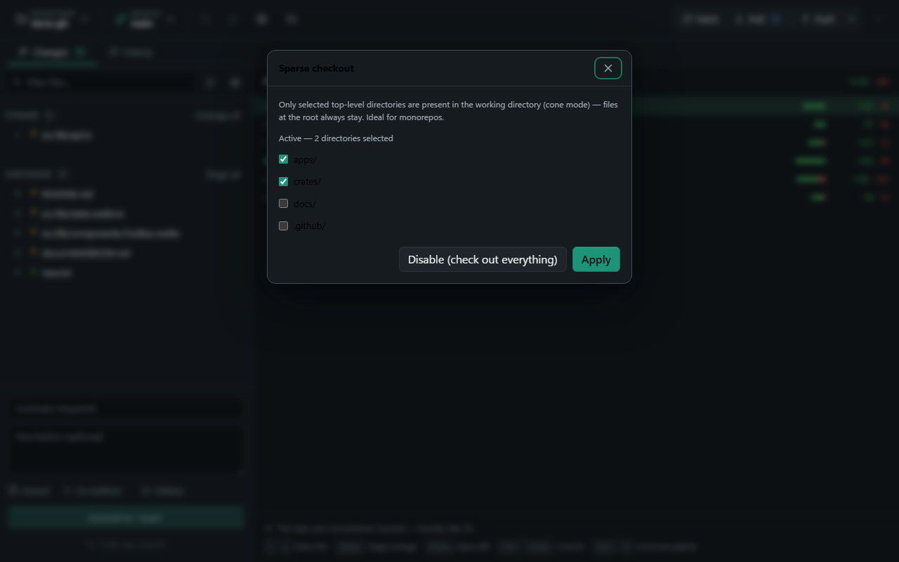

The checkbox list contains **only the top-level directories** of the current
commit, so there is no way to pick a single nested path — and files that sit
at the repository root are always checked out regardless of what you select.
The dialog says both: *Only selected top-level directories are present in
the working directory (cone mode) — files at the root always stay. Ideal for
monorepos.*

A status line above the list tells you where you stand: *Not active — the
full working directory is checked out.* or *Active — 3 directories
selected*. **Apply** writes the selection (*Sparse checkout updated*). You
cannot apply an empty one — *Select at least one directory — or disable
sparse checkout.* — and the way back out is **Disable (check out
everything)**, which only appears while sparse checkout is active (*Sparse
checkout disabled*). If the commit has no directories at all: *No
directories found in the HEAD tree.*

The files you deselect vanish from disk but are not lost; disabling brings
them all back.

## Settings

Open Settings from the toolbar's `…` menu (gear icon) or from the command
palette. Both routes need a repository open — with none open the start
screen always wins, so if you want to add an account token or set your Git
identity before anything else, open or clone a repository first.

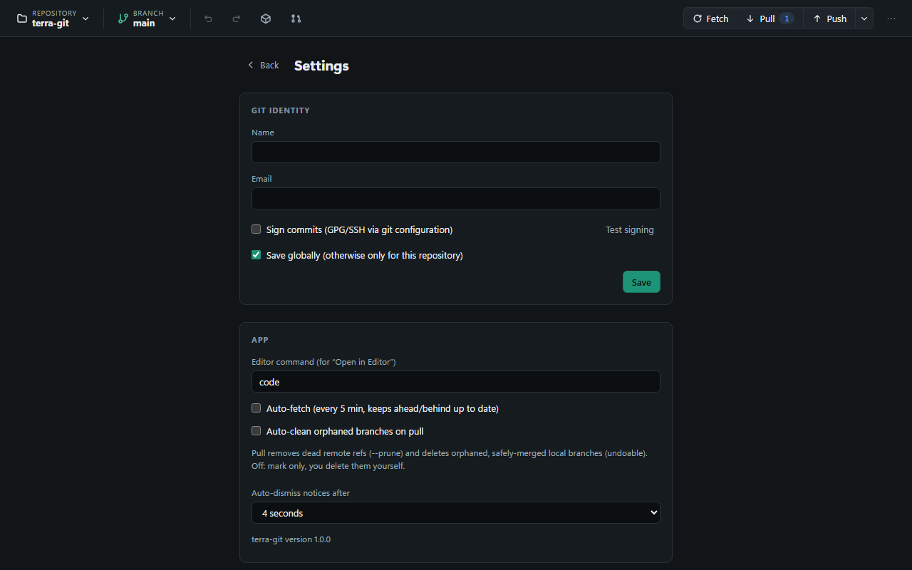

- **Git identity** — name/email, saved globally or just for this
  repository; commit signing (GPG/SSH via your Git configuration) with a
  "test signing" check.
- **App** — the editor command used by "Open in editor", auto-fetch every
  5 minutes, **Auto-clean orphaned branches on pull** (a pull then also
  prunes dead remote refs and deletes orphaned local branches that are
  safely merged, undoably; switched off, they are only marked and you
  delete them yourself), and how long informational toast notices stay on
  screen before auto-dismissing (2/4/8 seconds, or never — error toasts
  always stay until you close them). The installed terra-git version is
  printed at the foot of this section — that is the number to quote in a
  bug report, and it is also in the start screen's footer.
- **Accounts** — personal access tokens for GitHub, GitLab and
  Gitea/Forgejo, stored in the operating system's keychain; these unlock
  the PR/MR list and CI status. An account is a host plus a token.
- **SSH keys** — the local keys found in `~/.ssh`, each with its type,
  comment and fingerprint.
- **Theme** — dark, light, or follow the system. Also directly in the `…`
  menu and in the command palette.
- **Language** — switch between English and German without restarting; the
  default follows your system language. Also in the command palette, which
  is the only way to change it before a repository is open.
- **Accessibility** — font size (four steps), increased contrast, and
  reduced motion, applied immediately. The system's own "reduce motion"
  setting is respected regardless of what is chosen here.

### Connecting a host account

Pick the provider, type the **Host (e.g. github.com or
gitlab.company.com)**, paste a **Personal access token** and press
**Connect**.

The scopes matter, and the app prints them under the token field: *GitHub:
token with “repo” permission · GitLab: “read_api” scope · Gitea/Forgejo:
token with “repository” + “read:user” access*. Note that `read_api` is
enough to *see* merge requests; creating one needs write access.

The host field takes the host only, not a repository URL, and it accepts a
subpath for instances installed under one (`example.com/gitlab`). Only https
instances are supported; an `http://` host is rejected with a clear message
rather than failing later as a vague network error.

**Connect** validates the token against the host before anything is stored —
that is where the *@username* in the account row comes from, and it is your
confirmation that the token works. The token itself goes into the operating
system keychain, never into a file in the repository; only the host, the
kind and the user name live in the app's own configuration. The trash button
on an account row removes both.

**Disabling TLS verification.** For the GitLab and Gitea/Forgejo kinds there
is a checkbox: *Disable TLS certificate verification (insecure — only for
self-hosted with a self-signed certificate)*. Connected accounts then carry
a **TLS unverified** badge. It does two things: the API client stops
verifying that host's certificate, and — the part nobody expects — terra-git
also tells the underlying Git to skip certificate verification for HTTPS
remotes on that same host, so fetch, pull, push and clone against it stop
verifying too. Without that second half an account could list merge requests
but not sync, which would make a self-signed instance unusable; it is a
deliberate trade, not an oversight.

It is scoped as tightly as it can be: bound to that one host, so a second
remote to a different host in the same repository stays verified; applied
per operation rather than written into your Git configuration; and
irrelevant to SSH remotes, which use no TLS. There is no way to turn
verification off for github.com. Anything reached this way is open to
interception by whoever controls the network path, so this belongs on a
company network with a private CA, not on the public internet.

### SSH keys

The list shows the keys in `~/.ssh` that have a matching `.pub` file — a
private key without its public half does not appear. Per key you get a copy
button (**Copy public key**, which confirms with *Public key copied*) and a
trash button (**Move key to trash**).

**Generate key** creates an ed25519 pair in `~/.ssh` from a name (*Name
(e.g. id_ed25519)*), an optional comment and an optional passphrase. It
refuses if a key of that name already exists rather than overwriting one,
and it says so plainly if OpenSSH (`ssh-keygen`) is not installed.

Deleting is safe by construction: the confirmation is a dialog the operating
system puts up, not one the app draws, and the pair goes to the trash rather
than being erased — a misclick is recoverable.

What the manager deliberately does **not** do is register the key anywhere:
it neither adds it to your SSH agent nor uploads it. The workflow is
generate here, **Copy public key**, paste it into your provider's settings,
and let your normal agent and SSH configuration handle authentication. That
is also why a push can still fail with *SSH authentication failed
(publickey) — generate/add a matching key and upload it to your provider.*
after the key exists locally.

## Keyboard shortcuts

The app has no cheat sheet of its own, so this is the reference.

| Keys | What it does |
| --- | --- |
| `Ctrl+O` | Open a repository — on the start screen and in the workspace |
| `Ctrl+K` | Command palette |
| `Ctrl+Shift+F` | Fetch |
| `Ctrl+Shift+U` | Pull (needs an upstream) |
| `Ctrl+Shift+P` | Push |
| `Ctrl+Z` | Undo the last local operation |
| `Ctrl+Y` or `Ctrl+Shift+Z` | Redo |
| `Ctrl+F` | Find in the diff or the blame view |
| `Ctrl+G` | Go to a line in the diff or the blame view |
| `F3` / `Shift+F3` | Next / previous match |
| `Enter` / `Shift+Enter` | Next / previous match, from inside the find bar |
| `F5` or `Ctrl+R` | Re-read the repository status |
| `Esc` | Close a menu, the palette, the find bar or a dialog |
| `Ctrl+Enter` | Commit — from the summary/description fields or the changes overview |
| `Ctrl+A`, `Ctrl`/`Shift`-click | Select files in the changes lists |
| `←` `→` `Home` `End` | Move between the Changes and History tabs |
| `↑` `↓` `Home` `End` | Move through an open menu |
| Arrows, `Space`, `Enter` | Changes overview: select, stage/unstage, open the diff |
| `p` `r` `s` `f` `d` | Interactive rebase: set the action on the focused row |

A few of these behave unusually on purpose. The sync shortcuts only fire
while a repository is open, no dialog is open and nothing is already
running. `Ctrl+Z` and `Ctrl+Y` are ignored inside text fields — the normal
text undo applies there — and while a dialog is open, because a
repository-level undo in that moment would be a destructive surprise.
`Ctrl+O` and `Ctrl+K` likewise do nothing across an open dialog. And `F5` /
`Ctrl+R` refresh the repository status instead of reloading the window.

Some browser habits are switched off deliberately, because this is an
application window and not a web page: printing, view-source, `Ctrl` plus
`+`/`−`/`0` zoom, `Ctrl`+mouse-wheel zoom, and `Alt`+arrow for back and
forward. Menus give the focus back to the button that opened them when you
press `Escape`.

## When something fails

Messages appear in a strip at the bottom centre of the window.
Informational notices fade after the interval set in Settings → App;
**errors never disappear on their own** and stay until you close them, so
nothing is missed while you are away from the screen.

Three errors carry a button that fixes the situation on the spot:

- **Open conflict workshop**, after a pull or merge ends in conflicts;
- **Stash changes and switch**, when a branch switch is blocked by
  uncommitted work;
- **Open stash list**, when changes had to be left in a stash.

Those buttons are hidden while a dialog or the command palette is open and
come back when you close it — a button only the mouse could reach would be a
trap for keyboard users. The message itself stays put either way.

**The errors you are most likely to meet:**

- *Authentication failed. Check your credentials (is the token valid?
  credential manager?) — accounts can be added in Settings.* — for HTTPS
  remotes this is your system credential helper, not terra-git; for the
  PR/MR list it is the token under Settings → Accounts.
- *Push rejected: the remote branch has commits you don't have locally. Pull
  first (merge/rebase) — or deliberately overwrite with a force push.* —
  terra-git then puts up a **Push rejected** confirmation offering a force
  push (`--force-with-lease`) right away. Saying yes overwrites the remote
  branch with your local history, and teammates who already pulled it will
  have to sort that out. Unless you are cleaning up after a rewrite you did
  on purpose, pulling first is the right answer.
- *Rejected by the server (missing permission or protected branch). Check
  repository permissions and branch protection rules.* — usually branch
  protection on the default branch.
- *Repository not found on the remote. Check the URL (and whether you have
  access).*
- *Network error: the remote is unreachable. Check connection, URL and
  proxy/VPN if applicable.*
- *Provider rate limit reached — try again later.*
- *Access to the system keychain failed.* — a token could not be stored or
  read back.
- *Not a Git repository.* and *There is no commit to amend.* — exactly what
  they say.

**Logs for a bug report.** `…` menu → **Open** → **Open log folder** opens
terra-git's own log directory in your file manager. It holds one log file per day, named
`terra-git.log.<date>`; a crash additionally drops its own
`crash-<timestamp>.log` next to it. Attach both, together with the version
number from Settings → App (or the start screen's footer).

## Troubleshooting

- **"Switching would overwrite unsaved changes"** — this is not a merge
  conflict, even though Git's own wording for it ("conflicts prevent
  checkout") suggests one: the branch you are leaving and the one you are
  switching to differ in files you have edited but not committed, so the
  checkout would throw your edits away. You will rarely meet this message now
  that the switch [asks where your changes belong](#branches--merging) — it
  is left for the cases the question skips, such as a switch attempted while
  a merge or rebase is running. It names the files and offers **Stash changes
  and switch** right on the message; committing them works just as well.
  Nothing appears in the conflict view because there is no conflict to
  resolve.
- **SSH host key not verified or changed** — see [Unknown SSH
  hosts](#unknown-ssh-hosts).
- **Right-click does nothing** — that is deliberate. terra-git turns the
  browser-style context menu off across the whole app; only text fields get
  a menu (Cut / Copy / Paste / Select all). File and commit actions live in
  the `⋯` buttons on their rows, and a multi-selection in the changes list
  does have its own menu.
- **A list looks stale** — press `F5` or `Ctrl+R`. terra-git normally
  watches the repository on disk and needs no refreshing, but the key is
  there for the cases the watcher misses.
- **Pipeline runner not installed** — the local pipeline cockpit needs
  `gitlab-ci-local` (for `.gitlab-ci.yml`) or `act` (for GitHub Actions) on
  your `PATH`. The cockpit calls out which one is missing, and note that it
  needs the runner even to *show* the graph: without it you get *Could not
  read the pipeline configuration* rather than an empty pipeline.
- **Docker not running** — this differs by provider. For GitHub Actions the
  run is refused before it starts: *Docker is not running — act (GitHub
  workflows) requires a running Docker daemon.* For GitLab it is only a
  limitation: jobs that specify an `image:` will fail, plain shell jobs
  still work. Start Docker and use **Check again** on the Docker chip rather
  than reopening the view.
- **Missing tools on Windows** — `gitlab-ci-local` copies files via
  `rsync` in a bash shell; Git for Windows does not ship `rsync`. Install
  it (e.g. MSYS2 `pacman -S rsync`, or via `scoop`/`winget`) and make sure
  both `rsync` and `bash` are on the `PATH`.
- **Merge blocked in the commit workshop** — a merge commit in the range
  of unpushed commits blocks interactive rewriting of that range (*Range
  contains merge commits — not editable*); resolve or exclude the merge
  first. See [The commit workshop](#the-commit-workshop).
- **A whole file shows as rewritten (`−50 +55`)** — every line deleted and
  re-added, even though only a few lines really changed. This is not a
  display artifact: if your forge (GitLab, GitHub) shows the same thing,
  the committed content really does differ on every line. Git compares
  line by line and byte by byte, so an invisible change repeated on every
  line makes every line a different line.

  Four causes, in rough order of how often they turn up. Run these against
  the file to find out which one you have — whichever flag collapses the
  diff identifies the cause:

  | Check | Cause if the diff collapses |
  | --- | --- |
  | `git diff --ignore-cr-at-eol -- <file>` | Line endings (CRLF ↔ LF) |
  | `git diff --ignore-space-at-eol -- <file>` | Trailing whitespace |
  | `git diff -w -- <file>` | Indentation (tabs ↔ spaces, or a formatter) |
  | none of them collapse it | Encoding change (UTF-8 ↔ UTF-16, or a BOM), or a formatter that genuinely re-wrapped the text |

  To read such a diff without the noise, use `git diff -w` locally, or the
  **Hide whitespace changes** toggle in a GitLab merge request — terra-git
  itself has no whitespace option in its diff view.

  To stop it happening again, add a `.gitattributes` at the repository root
  containing `* text=auto`. Git then stores text with LF internally and
  writes the platform-native form on checkout, regardless of what any one
  contributor's editor does. terra-git's own repository does exactly this.
  After adding it, run `git add --renormalize .` once and commit the result
  on its own — that produces one deliberately large commit, after which the
  noise is gone.
